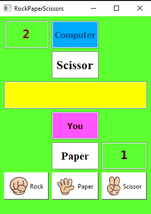
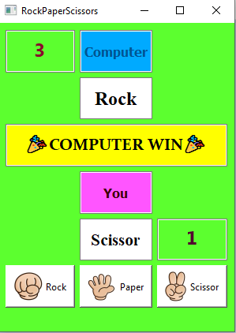
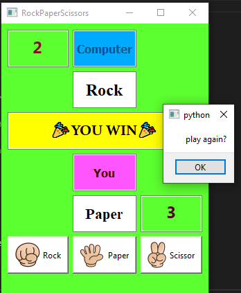

# Rock_Paper_Scissor Game


## python


This project is written in Python version 3.10.8

I have used the [pyside6](https://pypi.org/project/PySide/) library for this project.





As soon as the score of one of the players reaches 3, the winner is announced





And a new window will open asking the user to press OK if they want to play again



### **Usage**
---

First install pyside6 library
 ```
pip install pyside6
 ```
second write in the Terminall:
 ```
 pyside6-designer
 ```
 If the above is done successfully you can run the progaram.
  ```
main.py
   ```